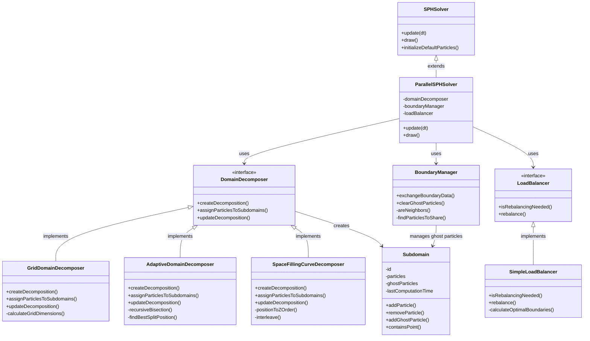

```mermaid
classDiagram
    class SPHSolver {
        +update(dt)
        +draw()
        +initializeDefaultParticles()
    }
    
    class ParallelSPHSolver {
        -domainDecomposer
        -boundaryManager
        -loadBalancer
        +update(dt)
        +draw()
    }
    
    class DomainDecomposer {
        <<interface>>
        +createDecomposition()
        +assignParticlesToSubdomains()
        +updateDecomposition()
    }
    
    class GridDomainDecomposer {
        +createDecomposition()
        +assignParticlesToSubdomains()
        +updateDecomposition()
        -calculateGridDimensions()
    }
    
    class AdaptiveDomainDecomposer {
        +createDecomposition()
        +assignParticlesToSubdomains()
        +updateDecomposition()
        -recursiveBisection()
        -findBestSplitPosition()
    }
    
    class SpaceFillingCurveDecomposer {
        +createDecomposition()
        +assignParticlesToSubdomains()
        +updateDecomposition()
        -positionToZOrder()
        -interleave()
    }
    
    class BoundaryManager {
        +exchangeBoundaryData()
        +clearGhostParticles()
        -areNeighbors()
        -findParticlesToShare()
    }
    
    class LoadBalancer {
        <<interface>>
        +isRebalancingNeeded()
        +rebalance()
    }
    
    class SimpleLoadBalancer {
        +isRebalancingNeeded()
        +rebalance()
        -calculateOptimalBoundaries()
    }
    
    class Subdomain {
        -id
        -particles
        -ghostParticles
        -lastComputationTime
        +addParticle()
        +removeParticle()
        +addGhostParticle()
        +containsPoint()
    }
    
    SPHSolver <|-- ParallelSPHSolver : extends
    ParallelSPHSolver --> DomainDecomposer : uses
    ParallelSPHSolver --> BoundaryManager : uses
    ParallelSPHSolver --> LoadBalancer : uses
    DomainDecomposer <|-- GridDomainDecomposer : implements
    DomainDecomposer <|-- AdaptiveDomainDecomposer : implements
    DomainDecomposer <|-- SpaceFillingCurveDecomposer : implements
    LoadBalancer <|-- SimpleLoadBalancer : implements
    DomainDecomposer --> Subdomain : creates
    BoundaryManager --> Subdomain : manages ghost particles
```