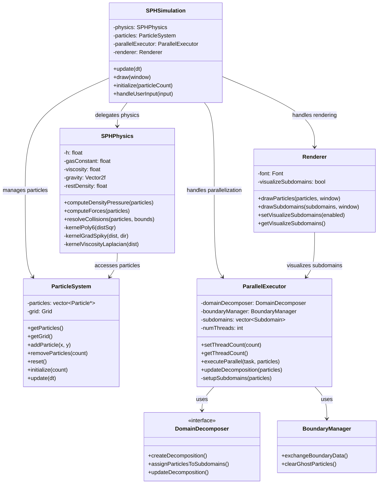

```mermaid
classDiagram
    class SPHSolver {
        +update(dt)
        +draw()
        +initializeDefaultParticles()
    }
    
    class ParallelSPHSolver {
        -domainDecomposer
        -boundaryManager
        -loadBalancer
        +update(dt)
        +draw()
    }
    
    class DomainDecomposer {
        <<interface>>
        +createDecomposition()
        +assignParticlesToSubdomains()
        +updateDecomposition()
    }
    
    class GridDomainDecomposer {
        +createDecomposition()
        +assignParticlesToSubdomains()
        +updateDecomposition()
        -calculateGridDimensions()
    }
    
    class AdaptiveDomainDecomposer {
        +createDecomposition()
        +assignParticlesToSubdomains()
        +updateDecomposition()
        -recursiveBisection()
        -findBestSplitPosition()
    }
    
    class SpaceFillingCurveDecomposer {
        +createDecomposition()
        +assignParticlesToSubdomains()
        +updateDecomposition()
        -positionToZOrder()
        -interleave()
    }
    
    class BoundaryManager {
        +exchangeBoundaryData()
        +clearGhostParticles()
        -areNeighbors()
        -findParticlesToShare()
    }
    
    class LoadBalancer {
        <<interface>>
        +isRebalancingNeeded()
        +rebalance()
    }
    
    class SimpleLoadBalancer {
        +isRebalancingNeeded()
        +rebalance()
        -calculateOptimalBoundaries()
    }
    
    class Subdomain {
        -id
        -particles
        -ghostParticles
        -lastComputationTime
        +addParticle()
        +removeParticle()
        +addGhostParticle()
        +containsPoint()
    }
    
    SPHSolver <|-- ParallelSPHSolver : extends
    ParallelSPHSolver --> DomainDecomposer : uses
    ParallelSPHSolver --> BoundaryManager : uses
    ParallelSPHSolver --> LoadBalancer : uses
    DomainDecomposer <|-- GridDomainDecomposer : implements
    DomainDecomposer <|-- AdaptiveDomainDecomposer : implements
    DomainDecomposer <|-- SpaceFillingCurveDecomposer : implements
    LoadBalancer <|-- SimpleLoadBalancer : implements
    DomainDecomposer --> Subdomain : creates
    BoundaryManager --> Subdomain : manages ghost particles
```

```mermaid 
classDiagram
    class SPHSimulation {
        -physics: SPHPhysics
        -particles: ParticleSystem
        -parallelExecutor: ParallelExecutor
        -renderer: Renderer
        +update(dt)
        +draw(window)
        +initialize(particleCount)
        +handleUserInput(input)
    }
    
    class SPHPhysics {
        -h: float
        -gasConstant: float
        -viscosity: float
        -gravity: Vector2f
        -restDensity: float
        +computeDensityPressure(particles)
        +computeForces(particles)
        +resolveCollisions(particles, bounds)
        -kernelPoly6(distSqr)
        -kernelGradSpiky(dist, dir)
        -kernelViscosityLaplacian(dist)
    }
    
    class ParticleSystem {
        -particles: vector~Particle*~
        -grid: Grid
        +getParticles()
        +getGrid()
        +addParticle(x, y)
        +removeParticles(count)
        +reset()
        +initialize(count)
        +update(dt)
    }
    
    class ParallelExecutor {
        -domainDecomposer: DomainDecomposer
        -boundaryManager: BoundaryManager
        -subdomains: vector~Subdomain~
        -numThreads: int
        +setThreadCount(count)
        +getThreadCount()
        +executeParallel(task, particles)
        +updateDecomposition(particles)
        -setupSubdomains(particles)
    }
    
    class Renderer {
        -font: Font
        -visualizeSubdomains: bool
        +drawParticles(particles, window)
        +drawSubdomains(subdomains, window)
        +setVisualizeSubdomains(enabled)
        +getVisualizeSubdomains()
    }

    class DomainDecomposer {
        <<interface>>
        +createDecomposition()
        +assignParticlesToSubdomains()
        +updateDecomposition()
    }
    
    class BoundaryManager {
        +exchangeBoundaryData()
        +clearGhostParticles()
    }
    
    SPHSimulation --> SPHPhysics : delegates physics
    SPHSimulation --> ParticleSystem : manages particles
    SPHSimulation --> ParallelExecutor : handles parallelization
    SPHSimulation --> Renderer : handles rendering
    ParallelExecutor --> DomainDecomposer : uses
    ParallelExecutor --> BoundaryManager : uses
    SPHPhysics --> ParticleSystem : accesses particles
    Renderer --> ParallelExecutor : visualizes subdomains
```